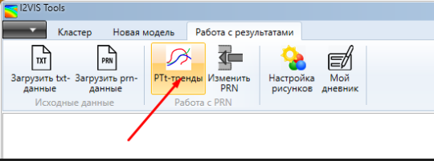
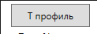
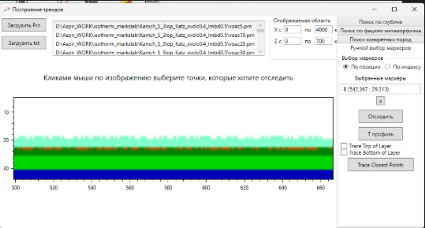

### Как работать
Перейти на вкладку работа с результатами 

Далее - PTt тренды

### Геотерма для одного шага
Загружаем .prn и одноименный voacc файл

Кликами по экрану набираем точки для трека

После заполнения точек выбираем 

Ждем результатов, построение может занять до 15 минут.
После результаты можно экспортировать в txt

### Отслеживание точки
Выбрать несколько prn -> загрузить референсный voacc
Выбрать точки 
Нажать отследить

